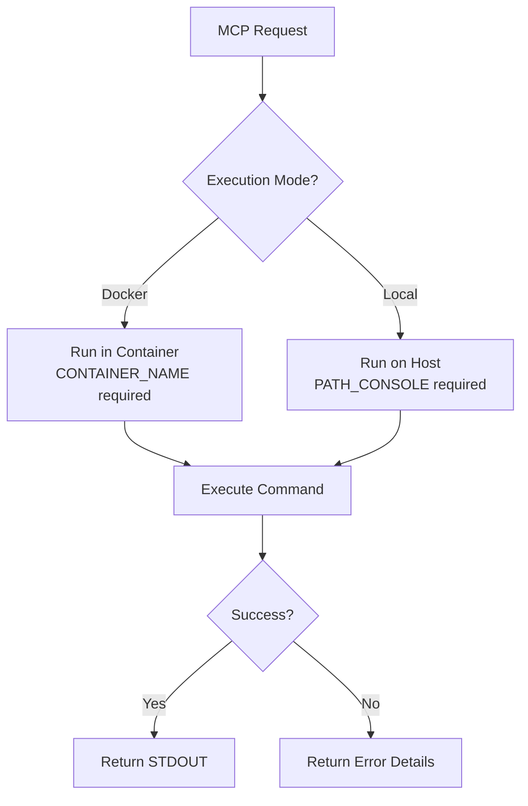

# Symfony Console MCP Server
[](https://github.com/marcbln/symfony-console-mcp)

Executes Symfony console commands in Docker containers or locally via Model Context Protocol (MCP).
Provides tools for command execution, listing, and help documentation.

## Table of Contents
- [Features](#features)
- [Environment Variables](#environment-variables)
- [Provided Tools](#provided-tools)
- [Installation](#installation)
- [Configuration](#configuration)
- [Development](#development)
- [Security](#security)
- [Contributing](#contributing)

## Features

The Symfony Console MCP Server provides a secure bridge for executing Symfony console commands through the Model Context Protocol (MCP). It supports two execution modes:

- **Docker Mode**: Executes commands inside a specified Docker container
- **Local Mode**: Executes commands directly on the host machine



## Environment Variables

| Variable | Required | Default | Description |
|----------|----------|---------|-------------|
| `EXECUTION_MODE` | No | `docker` | Execution mode: `docker` or `local` |
| `CONTAINER_NAME` | Docker mode only | - | Target Docker container name |
| `PATH_CONSOLE` | Local mode only | `/www/bin/console` | Path to console executable |

## Provided Tools

- **`execute_console_command`**: Executes console commands with argument sanitization
  ```json
  {
    "name": "execute_console_command",
    "arguments": {
      "command": "cache:clear"
    }
  }
  ```

- **`list_commands`**: Lists available console commands in JSON format
  ```json
  {
    "name": "list_commands"
  }
  ```

- **`command_help`**: Shows help for a specific command
  ```json
  {
    "name": "command_help",
    "arguments": {
      "commandName": "cache:clear"
    }
  }
  ```

## Installation

```bash
git clone https://github.com/marcbln/symfony-console-mcp.git
cd symfony-console-mcp
npm install
npm run build
```

## Configuration

### Docker Mode

```json
{
  "mcpServers": {
    "docker-console": {
      "command": "node",
      "args": ["/path/to/build/index.js"],
      "env": {
        "CONTAINER_NAME": "my-app-container"
      }
    }
  }
}
```

### Local Mode

```json
{
  "mcpServers": {
    "local-console": {
      "command": "node",
      "args": ["/path/to/build/index.js"],
      "env": {
        "EXECUTION_MODE": "local",
        "PATH_CONSOLE": "php /projects/myapp/bin/console"
      }
    }
  }
}
```

## Development

- `npm run build`: Compile TypeScript to JavaScript
- `npm run watch`: Development mode with live recompilation
- `npm run inspector`: Launch MCP Inspector for debugging

## Security

The server implements several security measures:

- Input sanitization to prevent command injection
- Docker container isolation in Docker mode
- Strict environment variable validation
- Error handling for missing or invalid parameters
- Separate I/O streams for control and data planes

## Contributing

Pull requests are welcome! Please include tests for new features and follow the existing code style.

## License

This project is licensed under the MIT License. See the [LICENSE](LICENSE) file for details.
